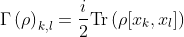

# cVQE

cVQE (compressed Variational Quantum Eigensolver) is a collection of classes to run Variational Quantum Eigensolvers
with quadratic Hamiltonians on 2log(n) + 1 qubits.
It provides variational forms, converters and initial states to be used with Qiskit Aqua's
algorithms.

## Installation

You can install `cVQE` with `pip`:

```bash
$ pip install cVQE
```

cVQE requires Qiskit >= 0.23.1.

## Running compressed VQEs

To run a VQE algorithm in compressed space you'll need to compress the Hamiltonian and use an appropriate ansatz. cVQE provides a converter to compress 1D quadratic homogeneous Hamiltonians, and a variational form and initial state to build an ansatz that can explore the whole set of quadratic Hamiltonians eigenstates:

```python
from qiskit.aqua.operators.operator_globals import I, X, Z
from cVQE.operators.converters import QuadraticOperatorReducer
from cVQE.initial_states import CompressedZero
from cVQE.variational_forms import CompressedFermionicGaussianState

# Set the original, fully compressed and final number of qubits 
original_num_qubits = 2
compressed_num_qubits = int(np.log2(n) + 1)
total_num_qubits = 2*compressed_num_qubits - 1

# Build the initial state
initial_state = CompressedZero(total_num_qubits)

# Create the variational form
var_form = CompressedFermionicGaussianState(compressed_num_qubits, initial_state=initial_state)

# Create a quadratic, homogeneous, 2-qubit Hamiltonian
H = (I^Z) + (Z^I) +2*(Y^Y)

# Compress the Hamiltonian
op_reducer = QuadraticOperatorReducer()
h = op_reducer.convert(H)
```

After these steps, you can use the variational form and the compressed operator to run a VQE algorithm. 

For more detailed and runnable examples, including the use of gradients, see the [examples notebook](examples/cVQE_examples.ipynb).

## Compressed space

### Matchgate circuits

A nearest-neighbour matchgate circuit on `n` qubits can either be simulated efficiently in a classical computer [1], or simulated using an exponentially smaller number of qubits, `log(n)`, in a quantum computer [2], provided that we measure an operator that is quadratic in the creation and annihilation operators.

The compression of such a circuit relies on three facts [3]. First, a quadratic Hamiltonian on `n` qubits can be written as


where the `x` are Majorana operators and `a` is a real antisymmetric matrix. `i*a` can be understood as a unitary gate acting on `log(n) + 1` qubits. Second, the set of Fermionic Gaussian states, which includes all ground states of quadratic Hamiltonians, is closed under the action of nearest-neighbour matchgate circuits. A Fermionic Gaussian state `ρ` can be completely characterized by its second moments, which are encoded in the covariance matrix



This matrix has the same dimensionality as `a`. It can be used to define a density matrix `σ` as


Finally, a matchgate circuit can be encoded in a rotation matrix `R` acting on `σ` such that


where 


If we are able to compress an operator `H`, and starting with any compressed Fermionic Gaussian state `σ`, we can use the previous identity to find the compressed ground state of `H` by means of a VQE algorithm where the ansantz implements a special orthogonal rotation of the qubits.

### Compressed Hamiltonian

The compression of a quadratic Hamiltonian relies on the fact that it can be written as


In terms of the Pauli matrices, a 1D quadratic Hamiltonian can only have the nearest-neighbour terms Z, XX, YY, XY and YX; and the compressed matrix `a` takes the form


where `C_{O_{i,j}}` is the coefficient of the operator `O` acting on qubits `i` and `j` in the original Hamiltonian. Only the upper triangle is shown, the lower triangle is defined by the operator antisymmetry. This is a banded matrix which is non-zero in the 3 diagonals up to the main one and the 3 down to it, and zero elsewhere.

In order to use the compressed Hamiltonian in a VQE algorithm, we need to know its decomposition in the basis of tensors of Pauli matrices. In general, this decomposition will have an exponential number of terms, posing problems to find the exponential number of coefficients and to measure the decomposition is known. 

Here we provide a classical algorithm to find the exponentially large decomposition of a 1D homogeneous quadratic Hamiltonian. Each of the Pauli string coefficients can be found in linear time and constant space. Moreover, despite the exponentially growing number of terms in the decomposition, commuting terms can be grouped so that the number of measurements grows linearly with the number of qubits of the compressed circuit.

First, notice that if the Hamiltonian is homogeneous, we can build `a` iteratively by using the fact that it's a banded matrix with repeating coefficients:


The first term builds a block diagonal matrix equivalent to joining two non-interacting systems of n qubits. `g_n` is the `2n x 2n` matrix with the interacting terms at the boundary, with non-zero elements


This iterative procedure must start with the 2-qubit compressed Hamiltonian, whose Pauli string decomposition is


To find the Pauli string of `g`, let's consider first the antidiagonal terms only. First of all, since `a` is antisymmetric, only antisymmetric Pauli strings will contribute, meaning that only Pauli strings with an odd number of Ys will have a non-zero coefficient. Moreover, for the antidiagonal terms, only those Pauli strings that are themselves antidiagonal can have a non-zero coefficient, because the decomposition of a `d x d` matrix `M` in a given basis `{σ_i}` is


More precisely, any tensor product of Pauli matrices whose anti-diagonal has terms `{..., a, b, c, d, ...}`, from the bottom left corner to the up right one, will have a coefficient


Therefore, we only need to generate all possible antidiagonal, antisymmetric Pauli strings, i.e. all Pauli strings consisting on X's and Y's with an odd number of Pauli Y's, and read out the central 4 terms to immediately know the coefficient of that specific Pauli string. Knowing the 4 central terms in a given Pauli string 


is only a matter of labeling the 4 central terms as `{a, b, c, d}`, from top right to bottom left, then starting with `{0, 1, 1, 0}` or `{0, i, -i, 0}` if `σ_1` is X or Y and applying the transformation `{a, b, c, d} -> {c, c, b, b}` or `{a, b, c, d} -> {ic, -ic, ib, -ib}` for every X and Y matrices.

For the non antidiagonal terms we can follow a similar reasoning to see that now only Pauli strings with the following non-zero terms will have a non-vanishing coefficient in this positions in the central `4x4` square:


The coefficient now will be


Such matrices are combinations of X and Y with an odd number of Y's, finishing by either an I or a Z. In this case, knowing the values of the four terms in the matrix can be done by following the same procedure as before, ending with the appropriate transformations: `{a, b, c, d} -> {b, -b, c, -c}` for I and `{a, b, c, d} -> {b, b, c, c}` for Z, provided that now we understand the labels as in


This procedure generates the decomposition of the compressed Hamiltonian in terms of Pauli strings, which is obviously exponential in the number of qubits due to the exponential number of Pauli strings that one can generate with any number of X and an odd number of Y matrices. However, every two groups of Pauli strings in the decomposition of `g_n` is a set of mutually commuting observables. To see this, consider any two operators in the first set. Here, the restriction that the strings have only X's and Y's, with an odd number of the latter, ensures that there will always be an even number of qubits whose operators are X for one operator and Y for the other. The rest of the qubits will have the same Pauli operator. This two facts make the two operators commute, for an even number of interchanged X and Y matrices commute. For the second set, all operators are members of the first set for `n-1` qubits with an additional I or Z, so the same reasoning applies.

Therefore, each of the two groups that are created for each step in the iterative process are a set of mutually commuting operators, and their expectation value can be computed in a single measurement. The total number of measurements is then linear in the number of qubits of the compressed Hamiltonian.

### Compressed states

A condition for the VQE to run in compressed space is that the initial state be a compressed Fermionic Gaussian state, so that we can explore the whole set of such states with an special orthogonal rotation. `cVQE` provides the compressed zero state. The zero state covariance matrix is defined by [3]


This matrix generates the density matrix


which corresponds to a mixed state. Therefore, in order to run a VQE in compressed space, we'll need to purify the initial state, an operation that can be done in `2m - 1` qubits for a density matrix of `m` qubits. For the compressed zero state, one equivalent purified state is


This state can be prepared with a circuit that applies a Hadamard to qubits `m` to `2m - 1`, an S gate to qubit `m` and a CNOT on qubit `i`, controlled by `i + m`, for `i` between `1` and `m - 1`. As an example, the circuit that generates the purified, compressed |00> state is


### Building an ansatz

The last step is to create the parameterized circuit that will implement the SO(n) rotation. Such a rotation can be decomposed into Givens rotations [4], which are rotations by a single basis vector:


The trigonometric functions appear at positions `(i,i)`, `(i,j)`, `(j,i)` and `(j,j)`, and all other elements are 0 except for 1s at the diagonal. 

For this decomposition, we only need to consider rotations where `i < j`, for a total of `n*(n-1)/2` parameters that completely define a SO(n) matrix. A Givens rotation can be decomposed into a quantum circuit consisting a multicontrolled RY gate and, possibly, up to two X and CNOTs as follows.

First, since `i < j`, this guarantees that the binary string for `i` and `j` will have at least one position `k` at which bit `k` is different in `i` and `j`. Pick any of those positions and place an RY gate controlled by all the other qubits being on. With the RY gate at qubit `k`, this unitary implements the Givens rotation between qubits |11...101...11> and |11...111...11>, where the 0 and the equivalent 1 are at position `k`. If any of the other bits in the binary string of `i` and `j` are not 1, we must make sure that they are both on before the RY gate. To accomplish this, simply apply an X gate if both are 0, a CNOT if they are 0 and 1 (in `i` and `j`, respectively), or an X and a CNOT if they are 1 and 0. After the RY rotation, revert this operations to get back the original state.

As an example, the ansatz for the compressed Fermionic Gaussian state of 2 qubits is


where one can see the state initialization and the SO(4) rotation composed by 6 Givens rotations.

### References

[1] [Jozsa, R. and Miyake, A. Matchgates and classical simulation of quantum circuits](https://arxiv.org/abs/0804.4050)

[2] [Jozsa, R. et al. Matchgate and space-bounded quantum computations are equivalent](https://arxiv.org/abs/0908.1467)

[3] [Boyajian, W. L. Matchgate circuits and compressed quantum computation](https://inis.iaea.org/collection/NCLCollectionStore/_Public/48/059/48059246.pdf)

[4] [Frerix, T. and Bruna, J. Approximating Orthogonal Matrices with Effective Givens Factorization](https://arxiv.org/abs/1905.05796)

## TODO

* Add tests.

## License

[Apache License 2.0](LICENSE.txt)
